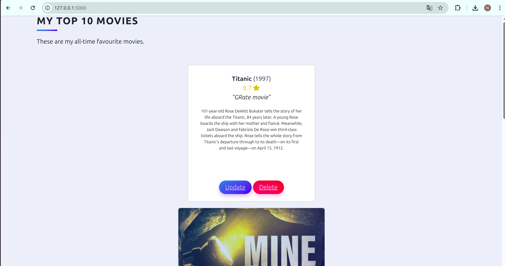
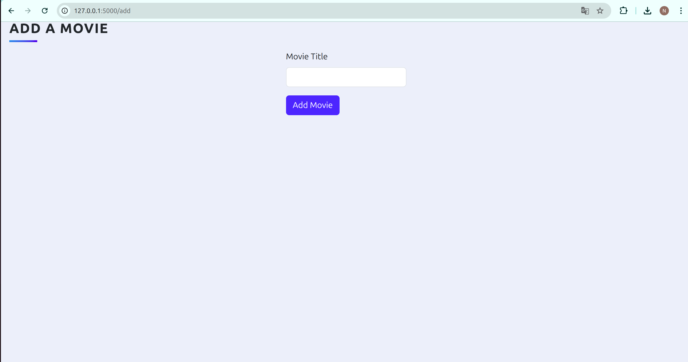
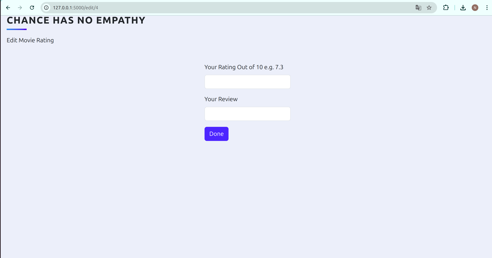

# Top Movies – Flask Web App

A simple Flask web application that lets you search, add, rate, review, and rank your favorite movies.  
Powered by [TMDb API](https://www.themoviedb.org/), uses SQLite for data storage and Bootstrap for UI styling.

---

## Features

-  Search movies using TMDb API
-  Add selected movies to your local database
-  Rate and review movies
-  Automatic ranking by rating
-  Edit and delete movies
-  Persistent storage using SQLite
-  Responsive UI with Bootstrap

---

## 🛠 Technologies Used

- Python
- Flask
- Flask-Bootstrap
- Flask-WTF (Forms)
- SQLAlchemy
- TMDb API
- SQLite
- HTML + Jinja Templates

---

## Screenshots

| Home Page | Add Movie | Edit Review              |
|-----------|-----------|--------------------------|
|  |  |   |

---

## Setup Instructions

1. **Clone the repo**

```bash
git clone https://github.com/your-username/top-movies-flask-app.git
cd top-movies-flask-app
